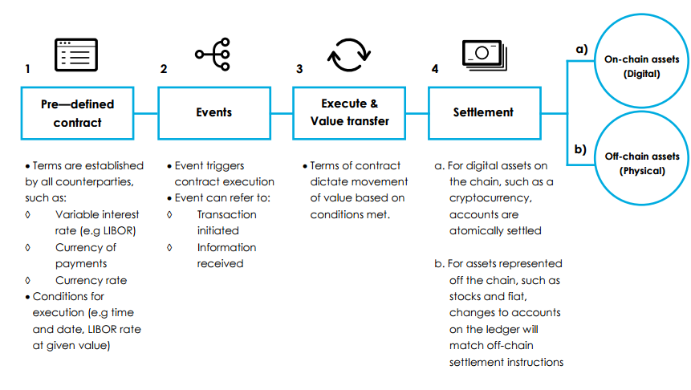

# What is Blockchain?

Blockchain is a technology that emerged with the creation of [Bitcoin](https://bitcoin.org/bitcoin.pdf) by Satoshi Nakamoto in 2009. 
The blockchain is the underlying technology allowing Bitcoin to work without any need of a trusted third party and by relying only on the 
protocol. Blockchains use a decentralized peer-to-peer network in order to achieve consensus and byzantine fault tolerance, on Bitcoin and Ethereum -
which are the most used blockchains - this consensus is achieved by proof-of-work which provides a probabilistic solution to the [byzantine 
generals problem](https://en.wikipedia.org/wiki/Byzantine_fault).  
The blockchain can be seen as a big ledger containing all the past transactions are consultable by anyone as they are on the distributed network. These transactions are
contained in "blocks", each block can contain a finite number of transactions, and the average time needed to create a new block is fixed
in the implementation level of the blockchain. As each block is linked to the previous one by a cryptographical proof (the block header of a new block contains the hash of the previous block), the transactions that are processed in a block on the blockchain are immutable. This
characteristic is necessary for transferring value when using this technology.

# The Ethereum Blockchain[1](#footnote1)

The [Ethereum Blockchain](https://github.com/ethereum/wiki/wiki/White-Paper) is an evolution of the Bitcoin blockchain protocol. The 
first release of the protocol was in 2015 and it evolved a lot since then. The intent of Ethereum is to create an alternative protocol 
for building decentralized applications providing a different set of tradeoffs useful for a large class of 
decentralized applications with particular emphasis on situations with rapid development time, and useful for the security of small and rarely used applications. Additionally, Ethereum provides the ability to  efficiently interact among applications. Ethereum enables this by building what is essentially 
the ultimate abstract foundational layer: a blockchain with a built-in Turing-complete programming language allowing anyone to write smart
contracts and decentralized applications where they can create their own arbitrary rules for ownership, transaction formats and state 
transition functions. Smart contracts, cryptographic "boxes" that contain value and only unlock if certain 
conditions are met, can also be built on top of the platform. Smart contracts have vastly more power than that offered by Bitcoin scripting because of the 
added powers of Turing-completeness, value-awareness, blockchain-awareness and state.

## The Smart Contracts[2](#footnote2)

A smart contract is a computer code running on top of a blockchain containing a set of rules under which the parties to that smart contract agree to interact with each other. If and when the pre-defined rules are met, the agreement is automatically enforced. The smart contract code facilitates, verifies, and enforces the negotiation or performance of an agreement or transaction. It is the simplest form of decentralized automation.  
The term smart contract is a bit unfortunate since a smart contract is neither smart nor to be confused with a legal contract.  

- A smart contract can only be as smart as the people coding it, taking into account all available information at the time of coding.
- While smart contracts have the potential to become legal contracts if certain conditions are met, they should not be confused with legal contracts accepted by courts and or law enforcement. However, we will probably see a fusion of legal contracts and smart contracts emerge over the next few years as the technology  matures and spreads, and legal standards are adopted.

Smart contracts radically reduce transaction costs.  Auto enforceable code – whether on the protocol level or on the application level – standardizes transaction rules, thus reducing the transaction costs of:

- reaching an agreement 
- formalization 
- enforcement 

A smart contract can formalize the relationships between people, institutions and the assets they own. The transaction rulesets (agreement) of the smart contract define the conditions – rights and obligations – to which the parties of a protocol or smart contract consent. It is often predefined, and the agreement is reached by simple opt-in actions. This transaction ruleset is formalized in digital form, in machine-readable code (formalization). The rights and obligations established in the smart contract can now be automatically executed by a computer or a network of computers as soon as the parties have come to an agreement and met the conditions of the agreement (enforcement).  
The concept of a smart contract is not new. However, Blockchain seems to be the catalyst for smart contract implementation. The most primitive form of a smart contract is a vending machine. The rules of a transaction are programmed into a machine. You select a product by pressing a number related to that product, insert the coins, the machine acts as a smart contract checking wether you inserted enough money, If yes, the machine is programmed to eject the product. If you inserted too much money, it will also eject the change. If you didn’t insert enough money, or if the machine ran out of product, you will get your change back. Automatic vending machines not only slashed transaction costs by making human vendors obsolete, they also expanded service, offering 24/7 availability instead of the limited opening hours of a kiosk.  

### Characteristics of a smart contract

Smart contracts are capable of tracking real time performance and bringing tremendous cost savings. Compliance and control happen on the fly. In order to get external information, a smart contract needs [information oracles](https://blockchainhub.net/blockchain-oracles/) which feed the smart contract with external information.  
Smart contracts are : 
- Self-verifying 
- Self-executing 
- Tamper resistant 

Smart Contracts can :

- Turn legal obligations into automated processes
- Guarantee a greater degree of security
- Reduce reliance on trusted intermediaries
- Lower transaction costs

<figure>
  
</figure>

## The ERC-20 Token Standard

## The T-REX Token Standard

The main goal of the T-REX standard is to create a set of global tools fully based on blockchain technologies. These tools allow the frictionless and 
compliant issuance and use of tokenized securities on a peer to peer basis or through marketplaces. By embedding control mechanisms in the tokens themselves, these tools remain in full compliance with regulations 
and issuers requirements. With T-REX, we are implementing a “Compliance by 
Design” approach where it is simply impossible for an investor to buy a security without being compliant. The regulator itself can verify 
the compliance of the Issuer through the auditing of the smart contracts that support the Security Token life cycle.

The management of compliant transactions through T-REX backed permission tokens will be based on 3 main pillars creating a decentralized 
Validator: 

- InvestorID: a blockchain based identity management system allowing the creation of a globally accessible identity for every stakeholder. 
- A set of claims as described in the [ERC-725](https://github.com/ethereum/EIPs/issues/725) and 
[ERC-735](https://github.com/ethereum/EIPs/issues/735) standards.
- A transfer manager whose role is to act as a filter of all the transactions of tokenized securities and check the 
claims of the stakeholders. Essentially it will check that the receiver has the rights to receive the tokens following the specific 
compliance rules and issuer requirements applicable for this specific asset. The transfer manager will block the transaction if the 
receiver misses a mandatory claim and will notify him about the reason of the failure. 

These 3 key elements allow issuers to use a decentralized Validator to control transfers and enforce compliance on the holders of the 
security token he issued. The Validator includes rules for the whole offering (e.g. managing the max number of holders allowed in a 
specific markets, when such rule apply) and rules for each investors (e.g. KYC or issuer-defined eligibility criteria) thanks to the 
identity management system.

### Constraints for Tokenized Securities

Although so far the rules applicable to issuing and holding utility tokens are largely undefined or very vague in most countries, STOs have to comply with the related regulations of the country where the security token is issued as well as those of the countries where it is distributed (sold). In fact, STOs consist in the issuance of a security that uses the blockchain technology as its registry, proof of ownership and transfer infrastructure. STOs are thus securities which, as financial instruments, are regulated in every country.

Characteristics | Utility Token | Security Token
:---: | :---: | :---:
Purpose | Usage | Investment
Regulation | Non existing or vague in most cases | Stringent as existing securities laws should be taken as reference
Lifecycle | Simple | As complex as a security
Secondary Market | Nearly no constraints | As complex as a security

Another significant difference between ICOs and STOs is related to the token lifecycle. ICOs - dealing with utility tokens - result in the issuance of tokens having a relatively simple life cycle: once the token is shared among a decentralized network, its governance is mostly the results of its token economics. As to security tokens, it is quite different. The issuer - or its appointed agent - remains generally liable for applying a number of controls to his token after issuance and during the entire “life” of its security token. In addition, he might need to apply a number of corporate actions (dividend/interests payments, … ) or corporate events (calling for an AGM/EGM, …) to its token which further increases the need for the issuer to keep in touch with (keep some control on) the investors in his token.

One could identify two main types of control requirements related to the issuance, the holding and the transfer of security tokens :
- One relates to regulations applicable to the security considered, that are independent of the security token itself (i.e. general rules). For example, the need to identify the investor, to collect a proof of his identity, to check his name against blacklists, i.e. generally speaking, control requirements related to AML/KYC, or other applicable regulatory rules.
- Then some controls might be related specifically to the security that is issued, for example, restrictions about the investor type and location or about the amount of money that can be invested on a certain period. These might be linked to the regulatory environment under which the issuer has decided to issue his token or simply linked to eligibility criteria defined by the issuer for instance, for commercial reasons (e.g. restricting the access of a certain share class, having specific fees characteristics, to investors of a specific country).

Addressing these different control requirements will require a high level of reusability and flexibility when designing the token. 
The T-REX standard has been developed for this reason. It  provides a set of generic tools helping token issuers to apply and manage the necessary controls and permissions to security tokens through a flexible decentralized validation system (the transfer manager), allowing them to add all the rules that need to be addressed to approve holding and transacting in their tokens.

### Necessity of Permissioned Tokens

All the experts of the sector agree on the point that only permissioned tokens are suitable to issue security tokens because there cannot be a total, uncontrolled, freedom of the transaction in such instruments and, investors need to comply with a number of criteria - either by regulation or imposed by the issuer himself in order to be eligible for holding the tokens. The main technical difference between standard [ERC-20](https://github.com/ethereum/EIPs/blob/master/EIPS/eip-20.md) tokens and T-REX permissioned tokens resides in the transfer function of T-REX tokens being made conditional, the condition for a transaction to be executed being that the transfer manager approves it according to the governance criteria defined for the the token in question. However, despite this modification of the transfer function of the token, it is to be highlighted that, because the token structure is based on the ERC-20 standard, it remains fully compatible with with it and all the available exchanges and tools based on ERC-20 tokens. 

Most of the “Security token protocols” promoted in the industry so far are permissioned tokens. The transfer function is modified and requests a transfer approval from an external validator service to control the transfer of tokens. 
T-REX involves an on-chain identity management system (InvestorID) allowing issuers to control the transfer of ownership directly on-chain.

### On-chain identity management

As mentioned before, by essence, a security token being subject to a stringent governance, its distribution has to follow all the applicable regulations and, in particular, those aspects related to KYC rules. In that respect, we believe that identity management is key to implement such compliance on the blockchain. 

As the ownership of a security token is registered on the blockchain, it is necessary to have a way to track the token ownership and to prohibit illicit transactions directly on the blockchain. This is why there is a need need to make a link between wallet addresses and identities and to manage rights through an identity contract directly on the blockchain. In addition, it is also needed to ensure privacy of those identities in order to comply with personal data related regulation. For this reason, personal data should not be stored directly on the blockchain but only the validation certificates (claims) issued by trusted third parties (KYC provider, government, lawyer,…) having checked these data. Those certificates (claims), stored in the identities of parties to a transaction will be used by the transfer manager to validate whether those parties are hold and transact a specific security token, or not. 

Linking an investor’s wallet and to his identity can bring significant added value to stakeholders in the nascent security tokens market. For example, it will allow a token issuer to replace the tokens of an investor if the investor loses access to his wallet (which happens pretty often and generally results in the loss of the owner’s assets ), by verifying that his on-chain identity fits with off-chain data linked to the identity contract corresponding to the lost wallet. After the identity of the investor is confirmed, the issuer can burn the lost tokens and mint new tokens on the new wallet of the investor. 

Also, on-chain identities and the certificates (claims) they store can potentially be re-used for passing KYC’s for other security tokens than the one for which those claims were originally provided or even for other purposes than investments (e.g. account opening at an exchange, identification with compatible web services, …). If Google and Facebook accounts are the identities of most people on the internet of information, investorID's on-chain identities can be the ones of the internet of value. They are really owned and controlled by their owner.

## Security of T-REX tokens

Security aspects of a blockchain based solution usually deal with three topics : the blockchain protocol, security of program deployed 
on the blockchain (Smart Contracts), and security of access to the blockchain (mainly key management).

### The Blockchain protocol

As of now, we have chosen the public Ethereum blockchain for the deployment of our tokens. Ethereum. It is the most powerful ethash (Ethash 
is an Ethereum mining Proof-of-Work algorithm. Ethash has been designed to be ASIC-resistant via memory-hardness and easily verifiable.) based 
blockchain, meaning that a 51% attack on this network would be almost impossible, not as smaller ethash blockchains like Ethereum Classic 
who suffered from a 51% attack (51% attack refers to an attack on a blockchain by a group of miners controlling more than 50% of the network's 
mining hashrate, or computing power.) very recently. As both blockchains are based on the same consensus algorithm which is PoW (proof-of-work),
the difference remains in the hashpower of each of them, in respect of which Ethereum (ETH) is far more powerful than Ethereum Classic 
(ETC) (143TH/s for ETH vs 8TH/s for ETC).The electricity cost of a 51% attack on ETC is estimated at $4,635/hour, while an attack on ETH 
would cost $78,250/hour according to [crypto51](https://www.crypto51.app/) at the time of writing. 
Additionally only 5% of the hashpower needed to perform a 51% attack on ETH is nice-hashable
(hashpower easily available for rent) while it stands at 77% for ETC, which means that an attacker would need to have its own mining 
hardware in order to proceed, which drastically increases the price of an attack : as 5% is nice-hashable and the total hashrate is 
143TH/s, an attacker would need to provide 68TH/s of hashpower through his own hardware. As the best hardware option on the market ( [Antminer E3](https://www.antminerdistribution.com/antminer-e3/) ) costs 
approximately $3,9/MH/s, the hardware needed for this attack would cost $265M. It should also be noted that this kind of specialized 
hardware (ASIC) has only one use case : mining ethash, so the total cost of the hardware would be lost in case of a big loss of trust on 
cryptocurrencies, while using this hashpower by following the rules of ETH would be highly profitable for the miner. 
The Ethereum community is aware of the future risks though, coming from quantum computing or big mining consortiums, and is on 
the path of switching the mining consensus method from PoW to PoS (proof-of-stake), first with a mixed consensus PoW+PoS ( [Casper](https://github.com/ethereum/casper) ) 
and then probably 100% PoS. 

### Security related to Smart Contracts

The T-REX smart contracts are designed for issuing and managing security tokens. While a 51% attack would allow double spending and could 
result in the theft of classical tokens by a pseudonymous individual (identifiable by his address on the blockchain, i.e. the address which
took profits from the theft) T-REX tokens are only transferable on addresses linked to an onchain identity based on ERC725 & 735 standards 
and containing all the claims that are necessary for a transaction to proceed. The onchain identities are linked to offchain data held by 
the token issuer and allow him to know exactly who is the owner of each address, in the case of a theft through double spending, the issuer
could sue this person in a court of justice. In addition of this, it is to be noted that a token issuer using the T-Rex solution is 
always in full control of the security tokens he issued, i.e. in case of a theft of security tokens, the token issuer (or, as the case may 
be, the agent that the issuer officially appointed to administer the security) could simply burn the stolen tokens and mint back tokens on 
the victim’s wallets. The tokens issuer also has the possibility to freeze tokens, to be sure that the stolen tokens are not circulating 
anymore.

### Keys management

The private keys unlock access to the funds held in wallets, these keys have to be stored either by the investors or by a custodian, the 
address of a wallet is obtained by hashing (keccak256) the public key derived through ECDSA (Elliptic Curve Digital Signature Algorithm) 
from the private key, which can be any number between 1 and 2^256 -1 in Secp256k1. 
This cryptographic process allowing to get the wallet address from the private key is not reversible, and is unbreakable at the moment, 
The best known algorithms for breaking ECDSA require O(sqrt(n)) operations. That means 2^128 operations would be needed to break an ethereum
account. [The largest ECDSA broken to date was 112-bits long](https://lacal.epfl.ch/articles/112bit_prime/), An Ethereum account is more than 4 billion trillions times harder to break. 
The only potential risk would be quantum computing (which is still a subject of research at the moment). It also means that if the investor
loses access to his wallet, i.e. loses his private key, it won’t be possible to grant him access to the wallet anymore, what the token 
issuer does in this situation is a recovery process for the T-REX tokens held in the lost account by burning them and minting new tokens 
on a new wallet provided by the identity holder, the new wallet has to be linked to the onchain identity (InvestorID) of the investor in order to 
proceed to the recovery and it can only be done after the investor provided all the necessary proofs that he’s the person he pretends to be. 
If a private key theft happens, the token issuer can also initiate the recovery process of the lost funds after freezing the account which 
has been compromised.

### Conclusion about security

As a conclusion, the risks based on the blockchain infrastructure that is used to issue the T-REX tokens are negligible, the cost 
of a 51% attack on the ethereum blockchain is so expensive that it that it makes it very unlikely. Additionally, would such an attack 
happen, mitigating actions/tools exist as the thief could be easily identified (allowing for legal action to be taken against him but also 
to blacklist him on all existing and future T-REX tokens) and, most importantly, the stolen assets could be frozen and then burned to mint 
them back in the victim’s wallets.

 
 

<a name="footnote1">1</a>: https://github.com/ethereum/wiki/wiki/White-Paper  
<a name="footnote2">2</a>: https://blockchainhub.net/smart-contracts/  

