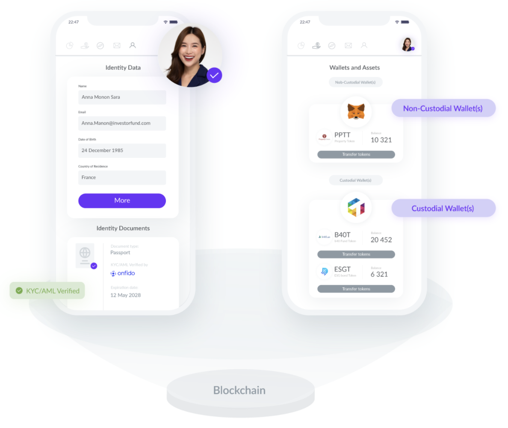
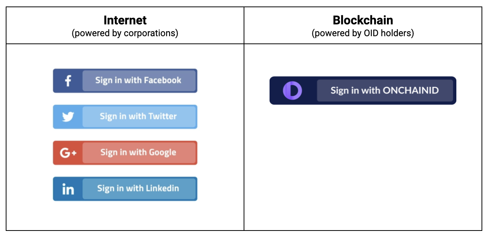
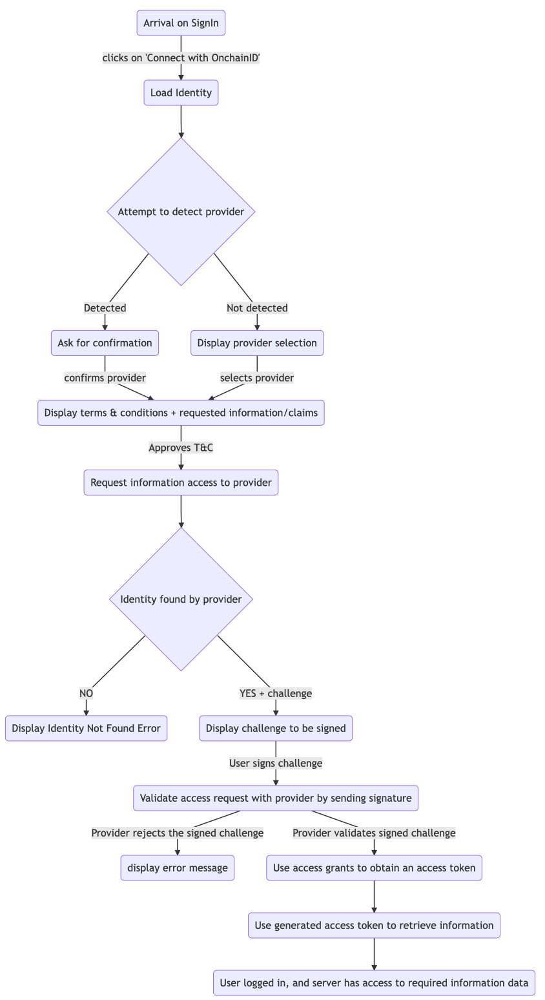
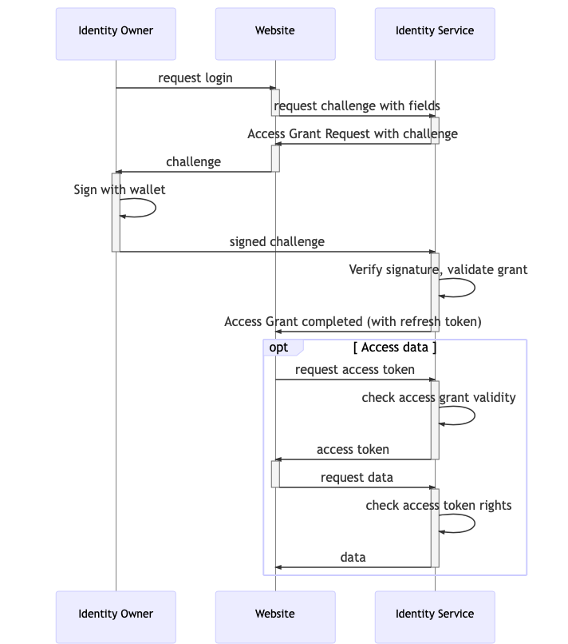
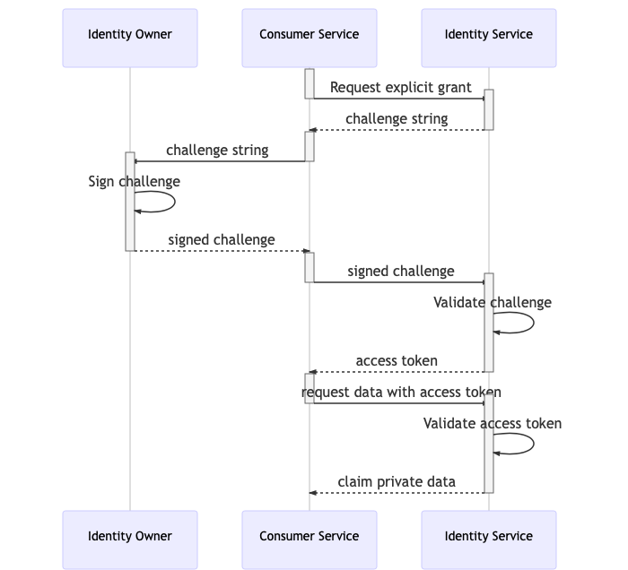

# How does it work? 

## How to get and manage an ONCHAINID
Concretely, ONCHAINID identities are Smart Contracts, deployed on the blockchain. Users can get their own identity by using the ONCHAINID web app, or by following the onboarding process of a compatible DeFi protocol, security token issuer or digital asset marketplace. 

The user provides their  information and documents depending on the use case and automatically obtains his ONCHAINID smart contract with signed certifications on the blockchain. Technically, his smart contract is deployed by the ONCHAINID software, and then the management keys are given to the main wallet of the identity owner. The identity can then be enriched and evolve according to the needs of the user and the applications he uses.

ONCHAINIDs can be managed directly on the ONCHAINID web app, but also on other front-ends provided by authorized service providers. For example, the issuer of a security token applying compliance rules with ONCHAINIDs may propose an investor portal to its clients and allow them to directly manage their identities from there. This use case is already live with dozens of security token issuers using [Tokeny’s solutions](https://tokeny.com/t-rex-platform/).

Managing an ONCHAINID as an Identity Owner means managing:
- Identity information
- Wallet(s) authorized to manage the identity
- Claims, meaning the onchain proofs signed by trusted third-parties
- Accesses to the identity information

## Enrich and control identity information

An ONCHAINID has a unique blockchain identifier: its smart contract address. In this smart contract, proofs of identity data are signed by Claim issuers. Several services can store information about an Identity, while keeping this information outside the blockchain. By default, Tokeny acts as the core developer of the system and securely hosts the basic data of identity holders. 

For instance, the service that deployed the Identity will probably store name, email address, postal address, country, website, and maybe other pieces of data about the identity. A service that stores and diffuses information about an Identity is called an Information Provider. 

Any Service Provider is able to request this information from the Information Provider. It provides the data only if the Service Provider is allowed to access the information. The Identity Owner has complete control over what information is shared with which services.

## Onchain identity proofs (claims)

Claims are certifications of identity data visible in the ONCHAINID smart contracts. They can be obtained from several sources: 

* Identity Owner (known as "self-attested" claims), 
* Claim Issuers, or anyone the Identity Owner has allowed to add claims to their identity (CLAIM key or MANAGEMENT key).

Claims are stored in the Identity contract thanks to the functions provided by the ClaimHolder standard, ERC-735, that are implemented on the Identity contract.

Issued claims can be removed from a ClaimHolder by: 

- Identity Owner (has the ability to remove ANY claim);
- Technically anyone the Identity Owner allowed to manage claims on its identity (CLAIM key or MANAGEMENT key).

> Note that there is NO WAY to verify that the identity is strictly compliant with the standard. It is therefore important for users to generate their ONCHAINID via a compatible application, and to avoid self-deployments of identity smart contracts.

The ONCHAINID standard allows claim issuers to revoke claims they issued without interacting directly with the ClaimHolder contract holding the claim, it allows the claim issuer to invalidate a claim without the approval of the ClaimHolder.

A claim signer may only issue one claim per type per Identity. It will be stored by a unique identifier composed with the issuer address and the claim type. Issuing a new claim for the same type will override the first instance. A claim issuer has NO CERTAINTY that the claim will be added or updated, as the Identity contract implementation could deny the update. The only security is that NO ONE can fake the claim issuer signing key, thus a valid claim can only be issued by an approved Trusted claim issuer.

Claims may be related to sensitive data. To respect privacy, this data cannot be publicly stored on the blockchain. A Trusted claim issuer should store the data they checked in a secured off-chain database, and refer to this data in the added claim. By default, ONCHAINID core developers already provide the complete data management system. 

To ensure compliance, a hash of this  data should also be stored with the claim added to the Identity. As external data is not accessible from within the blockchain when transactions occur, the claim should be self-explanatory to validate compliance for the given token, without exposing sensitive data. When the claim is related to data that is part of an exhaustive list of possibilities (i.e. gender, country of residence, age, ...), the hash is not enough to keep the data private as it is pretty easy to find the private data by iterating on a limited list of possibilities, hence, in this case, it is important to hash a concatenation of this data with another data that is not part of an exhaustive list (e.g. last name or first name of the user).

Some claims are therefore shareable between DeFi protocols and between tokens of multiple issuers (for instance: accreditation status) and are called Generic Claims, or between token for a same issuer (for instance, the fact that the investor is approved for token investment for a set of tokens) and are called Specific Claims. Specific claims can be customized per protocol, per token or per issuer (for instance, the token issuer asks for a claim check that will allow him to know that the investor satisfies a set of criteria like country, occupation, in a list of approved ones that he configured with the claim issuer). Generic claims are public statuses that usually have an expiration date.

To generate a claim, a Claim Issuer can ask the Identity Owner all data it requires through a custom User Interface, mail exchanges, research... Some Claim issuers allow Identity Owners  to share their information with other Claim issuers approved that implements an OAuth client. The list and content of data shared are explicitly displayed to the user when an access is requested by an application. A claim can be requested by anyone for an Identity.

## Connect with ONCHAINID

An ONCHAINID allows a user to login to a website using their Identity in a similar way to the current available Social Provider authentication offered by Twitter, Facebook, and Google.

When the user attempts to authenticate, the server generates a challenge to be signed using a wallet linked to the Identity.
The server can request access to some Information and claims about the Identity.

The following process explains the authentication flow for the "Connect with ONCHAINID" feature.

To summarize, a website requests access to a certain set of information and allows the connection once it has all the access it requires.

The website (or service provider) can request more access, but it requires a new signature from the Identity Owner each time.

An Identity owner can share, with the request service, a list of data related to their Identity. The Identity Owner signs this list, and the service has access to this list only. This may include:

- First and Last Name
- Email
- Phone number (if available)
- Address
- Any claim data stored by the Tokeny Identity Service.

Once the Identity is connected, the Identity Owner will be able to share additional data and or information stored by other Information Providers or Claim issuers.

There are multiple ways to required access to information: 

- Immediate grants; which only allow access once to information.
- Persistent grants; which allow longer-term access until the grant is revoked by the Identity Owner.

Refer to the sharing data section below for more information about access grants.

## Sharing Identity data

ONCHAINID gives the Identity Owner the control of his/her Identity. When an Identity Owner decides to share information about the Identity with a third-party service, an explicit signature and access challenge is requested.

This allows Information consumers to request access to identity data such as:

- Basic Information: first name, last name, email, phone, address.
- Claim data (access to a precise claim content) 

By signing an access challenge, the Identity Owner creates an Access Grant for a service, that can be revoked if needed.

> Note that a revocation will not delete the data stored by the service, but will prevent it from access again.

The following sequence diagram illustrates the access grant flow:

## Types of Access grants

There are two types of access grants flow:

Synchronous immediate grant
The user will sign a challenge that the service will use immediately to access the data. The access grant can be used only once. The grant will remain stored.

Asynchronous persistent grant
Service requests access to the data. The identity owner will be notified and will be able to later approve the request. The access grant can be used until it is revoked.

An Access Grant can be requested with a `POST` from the URI of the resource to be shared, with `/access-requests` appended.

For instance, if a claim has to be shared, and its URI is `GET http://api.identity-service.example.com/claims/09724-IiuD73-989bjD8` the access grant request url will be `POST http://api.identity-service.example.com/claims/09724-IiuD73-989bjD8/access-requests`.

The response Location will point toward the URI of the Access Grant request, which can be itself validated by appending `/validations` to the `POST`  request.

In the above example, to validate the access grant request, call `POST http://api.identity-service.example.com/access-grants/8hy67-hu79k-gf76hk/validations`.

Information Providers should support at least one of the following authentication methods for Service Providers:

- API Keys.
- Challenge Signature flow.

Fig 1: Synchronous Immediate grant

Fig 2: Asynchronous Persistent Grant

The confirmation response from the Identity Service returns to the requester service the challenge to be signed.

This means that the service can request the identity owner's signature without having to wait for the notification to be sent to the user.

## Revoking and monitoring Access Grants

Each Information Provider offers a different level of access and grants control. Some might accept only immediate grants.

Some will allow identity owners to see which access grants they emitted, both immediate and persistent, and how they are currently used.

When an Identity Owner revokes an Access Grants, the related service should no longer be able to access the data.