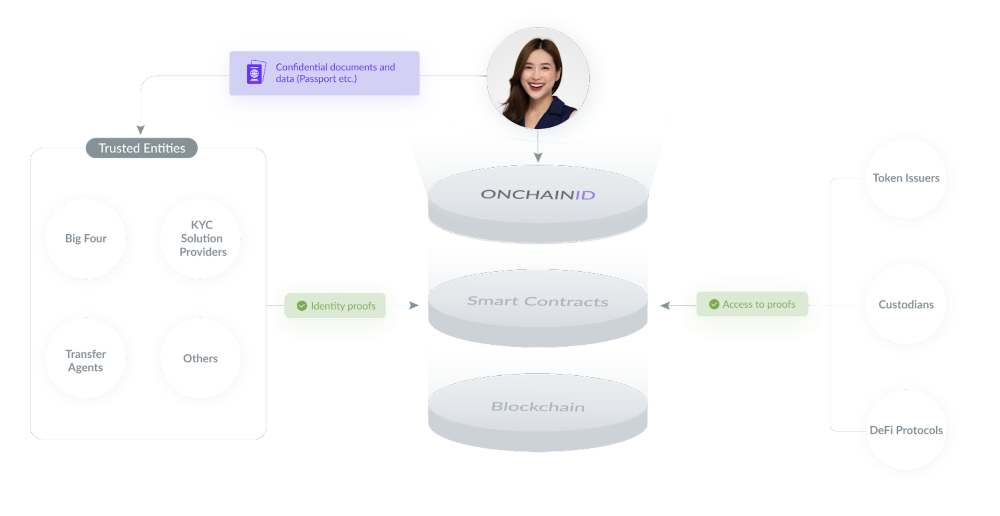
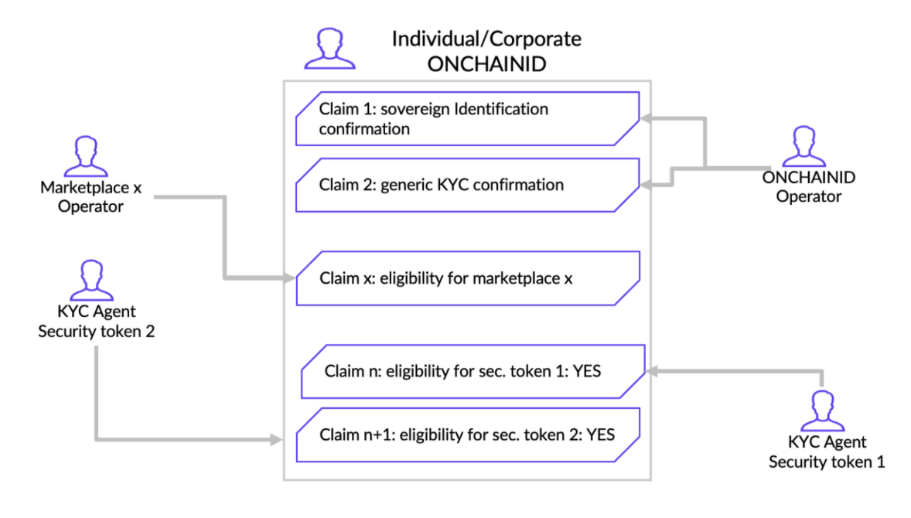

# What is ONCHAINID?

The ONCHAINID protocol is a set of smart contracts (based on ERC734-735) and applications to represent individuals, companies, programs, objects and other types of assets on the blockchain. This allows them to be identified digitally and to assign them rights, duties or simply information, over a decentralized infrastructure.

ONCHAINID self-sovereign identities are stored on the Polygon network, in a decentralized way. They could be deployed on any EVM (Ethereum Virtual Machine) compatible blockchain network. They can't be hidden or deleted. No service or organization can remove its owner access rights to it, and it spans a lifetime. 

Yet, an Identity has no value itself. It is the information (claims) attached to it that gives credit to the identity. This information can be self-attested, or signed on the blockchain by a trusted third-party such as a bank, a digital national ID key, a digital asset marketplace, a transfer agent, an auditor, etc. It creates identity proofs that can be used by token issuers, custodians, DeFi protocols, etc.

Regulated exchanges, however, requires an Identity to be a "real" one, linked to an existing person or organization. Proof of this information is called a Claim.

They are issued by any Claim Issuer that is allowed by the Identity Owner to publish claims about the Identity.
For example, a Claim Issuer could emit a claim saying that a given Identity has passed an Identity Check with an ID card and a selfie.

Of course, sensitive information is not stored publicly on the blockchain. The Claim Issuer will store the claim private data on secure off-chain servers, and will publish publicly on-chain a signature attesting the data verification. Therefore, anyone knows that a trusted third party has successfully checked the identity. But to access the data, one would need the explicit consent of the Identity Owner allowing the consultation of the private data. If the proof of identity is not issued by a credible entity in the opinion of someone who needs it, it can do its own checks. The identity owner can share this information with him by giving him simple access to his ONCHAINID.

Therefore, ONCHAINID allows identity holders to aggregate their information and certifications on a single identity, while maintaining decentralization of the data storage.

As a result, ONCHAINID allows onchain **compliant pseudonymity**:

Anonymous | Pseudonymous | Public
:---: | :---: | :---:
actual state in blockchain | ONCHAINID | Not acceptable in blockchain
Users are free to manually or automatically create wallets. Access is controlled by digital keys which can be exchanged, lost or stolen.It is not possible to guarantee on the blockchain who is the holder of the wallet and the tokens and rights that it holds. If the wallet address is technically a pseudonym, users can change easily and manage many in parallel, making it difficult to create a unified identity profile. While wallets can have been whitelisted (potentially by many parties), there is no evidence of its whitelisting/acceptance on the blockchain.| Each user controls its own identity smart contract in which they can manage their personal information, link one or more wallets, and give access to all or part of their information to trusted third parties.Directly on the blockchain, it is possible to guarantee the ownership of wallets, data and assets. Users use their pseudonym (ONCHAINID address and/or ENS) to identify themselves and prove through blockchain evidence that they are eligible to use permissioned protocols or permissioned tokens. | Identity information is obviously confidential and publicly revealing it can create significant identity theft problems. This is especially the case on the blockchain where most applications concern the transfer of value and management of assets.

In short, ONCHAINID is:

- A self-sovereign identity system
- An aggregator of certified information 
- A smart contract under the control of the Identity owner
- A compliance layer preserving confidentiality
- A universal login for the internets
- A multi-wallets and multi-assets management system
- Usable for individuals, companies, assets, protocols and things.

The ONCHAINID system was originally designed as an integral part of the T-REX Protocol, allowing the issuance, management and transfer of permissioned tokens: The issuer of the token acts as a trusted entity for its token holders. It is mostly used for security tokens, payment ecosystems and loyalty programs. 

In particular with regards to investors, those identities allow them to securely (hashed) maintain on the blockchain either information or, more generally, links to information about themselves that they can, under their own control, make available to 3rd parties (a KYC provider, a website in which they want to login, authorities, …) on request. 

Most interestingly, it allows accredited parties - Trusted Claims Issuers - to add  qualifying information to an identity (e.g. a KYC provider having checked an investor and attaching to the investor identity a “statement” that he qualifies for holding and transacting in a certain security token; a marketplace operator adding a claim to an investor identity reflecting that he has been duly checked and admitted as an investor on that marketplace, ...). Note that, in fine, it is always the identity owner who will decide whether or not a claim is added to his/her identity.

The ONCHAINID ecosystem already provides the following tools for anyone willing to integrate the standard : 

- The smart contracts to be used for identity management on the blockchain, based on the ERC734/735 standards (such contracts are already used in production on both Ethereum and Polygon by TREX tokens stakeholders);
- Documentations, APIs and SDKs (Software Development Kits) to create and interact with these identities (in particular for trusted third parties);
- Interfaces needed to create and administer the identities, as part or independently of a security token subscription process.
