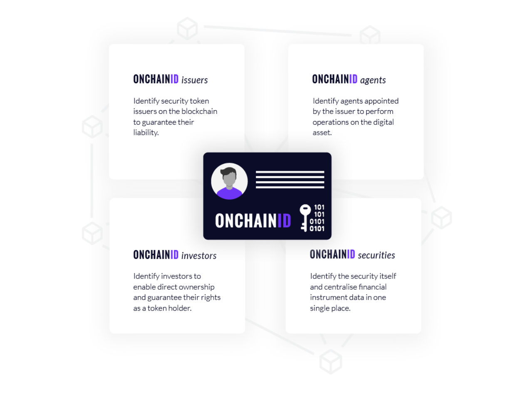

# Introduction to ONCHAINID concepts

## What is ONCHAINID?

ONCHAINID is a blockchain-based identity system that identifies individuals and organisations, allowing them to enforce compliance and access digital assets.

ONCHAINIDs are self-sovereign identities. This means that each holder of an identity is in control of their information and who has access to it.

For more information, please visit: https://tokeny.com/onchainid/ 

## How does it works technically

 **ONCHAINIDs** are smart contracts deployed on the blockchain.

Their *address* is a unique identifier that can safely be used by a service provider to identify their owner, and even to sign requests such as direct authentication on a website.

Claims can be attached to prove legislation based compliance with tokenized assets.

For example, an ONCHAINID allows an investor to truly own their identity, whilst allowing trusted services to emit claims for it. The data associated with the identity and its claims are under the control of the investor who can share them with other service providers as and when is necessary.

They are fully compatible with every security token based on the [T-REX standard](https://github.com/TokenySolutions/T-REX) (Token for Regulated EXchanges).

The following documentation introduces the concept of ONCHAINID and demonstrates some of its use-cases. It also contains the documentation for several tools related to ONCHAINIDs such as the Identity SDK.

