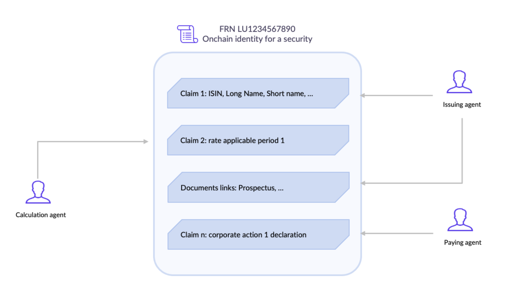

# Use cases 

## Onchain Assets ownership

As explained previously, the allocation and enrichment of ONCHAINIDs makes it possible to identify individuals, companies and assets on the blockchain. It is therefore possible to execute actions (transactions) on the blockchain that take into account the different parameters of these identities. It is therefore possible to create "permissioned tokens", which will be controlled by a central issuer, which can only be transferred to eligible ONCHAINIDs, and which can be recovered in case of loss of private keys. This protocol for permissioned tokens already exists, and is called T-REX (Tokens for Regulated Exchanges). For a few years it is used for security tokens as many compliance rules must be applied to financial instruments, but also for any type of assets where an issuer of a token needs to track and guarantee the legal ownership of the token. For example a custodian could immobilize shares, paintings, NFTs, stablecoins, or bitcoins and represent them with T-REX permissioned tokens. These tokens can be deployed on any Ethereum Virtual Machine compatible blockchain network such as Ethereum mainnet, Polygon, Binance Smart Chain, etc. Because they are permissioned with ONCHAINIDs, these tokens are recoverable: As long as a token holder can prove his identity to the issuer, he can recover his/her tokens. Even if the wallet changes on the blockchain, the owner doesn’t change because the lost wallet and the new wallet are both linked to the same onchain identity. Therefore, it facilitates self-custody, without the risk of self-custody. 

Today, if you lose access to your bitcoin wallet or your ERC20 wallet, nobody can help you. With ONCHAINIDs and permissioned tokens, as long as you can prove your identity you can recover them. 

## Identities for Assets and Securities 

It is already possible to extend this notion of identity to the financial instruments and assets i.e. attaching to the root smart contract of a token or an NFT a container where various data related to the security or asset itself will be stored. For example, for a security token, some data can be linked and certified onchain:
- The static data about the financial instrument: name, type (debt, equity, fund, …), date of issuance, maturity date, etc …;
- The dynamic data of the security will be added by the issuer or his agents along the life of the security: dates and rates of cash distributions, corporate actions, AGMs/EGMs, …
- Other “claims” added by trusted parties. This will be particularly useful to receive the assessments made by the relevant “boards” on the investment policy of the security e.g. for shariah compliant or ESG compliant instruments.

The use of such “security identity” will solve the issue existing very often to access reliable (so-called “golden copy”) and up-to-date information regarding a security. It is to be noted that such “security identities” could naturally be issued for securities issued as tokens on the blockchain but also very well for securities issued more traditionally.

Of course, many use cases are possible following the same logic. For example, a real estate developer could deploy an ONCHAINID for a building where the architect, the electric company and others would provide and certify information. It would help owners, potential buyers and other entities to evaluate the building depending on their criteria (economic value, energetic impact, etc.). 

## DeFi for institutions

DeFi is growing but still under construction. Regulation is struggling to keep up with the high rate of change, but the obligations of institutions are no less important. As we have seen with the launch of AAVE Pro (rebranded in AAVE Arc), there is a demand from institutions to invest heavily in DeFi, but in a framework where all the counterparts are known and / or controlled, at least in terms of KYC. The ONCHAINID protocol allows the various counterparties to prove their eligibility and verify that of the others, without revealing the identities of all the participants. 

Thus, for example, the identity of the deployer of DeFi protocol smart contracts can be verified to ensure that it does not appear on the main sanction lists. Also, it is possible to restrict the use of the protocol according to certain criteria, or to block / unblock functionalities according to attributes linked to the identities. We can easily imagine restrictions by type of investor (individuals vs corporates), by country, etc.

## Universal login & digital identity

First and foremost, ONCHAINID facilitates compliance by helping its users to prove that they are legitimate to websites, DeFi protocols and tokens issuers. This is possible thanks to the “blockchain account” held by the owner of the identity. Since this identity is digital, it was made in such a way that it can be linked to an email, and to one or more wallets. It is also compatible with most types of authentication keys. 

Crypto-asset marketplaces can therefore use the ONCHAINID login to facilitate the onboarding of their users, request access to the identity proofs they need, and easily apply the compliance rules to their users, without however taking possession of their assets. 

## IOT & Oracles

More and more, we interact with computer programs contained in everyday objects. Think of your smartphone and your car for example. Also, these programs interact with each other and become interoperable and communicating. Soon, thanks to the blockchain, they will not only share information but also value. Providing ONCHAINIDs to things will help to identify each of them onchain and to manage their roles and permissions.

As an example, you could park your car in a parisian street, and automatically it would be detected by the sensor of a meter that will request information to the car in order to know its owner and charge its account with the parking fees. If the car has an ONCHAINID, its owner account would be a Claim (proof), certified by the national car registry. The meter could also verify at the same time that the car got the Crit’air ecologic pass by checking this other claim. 

