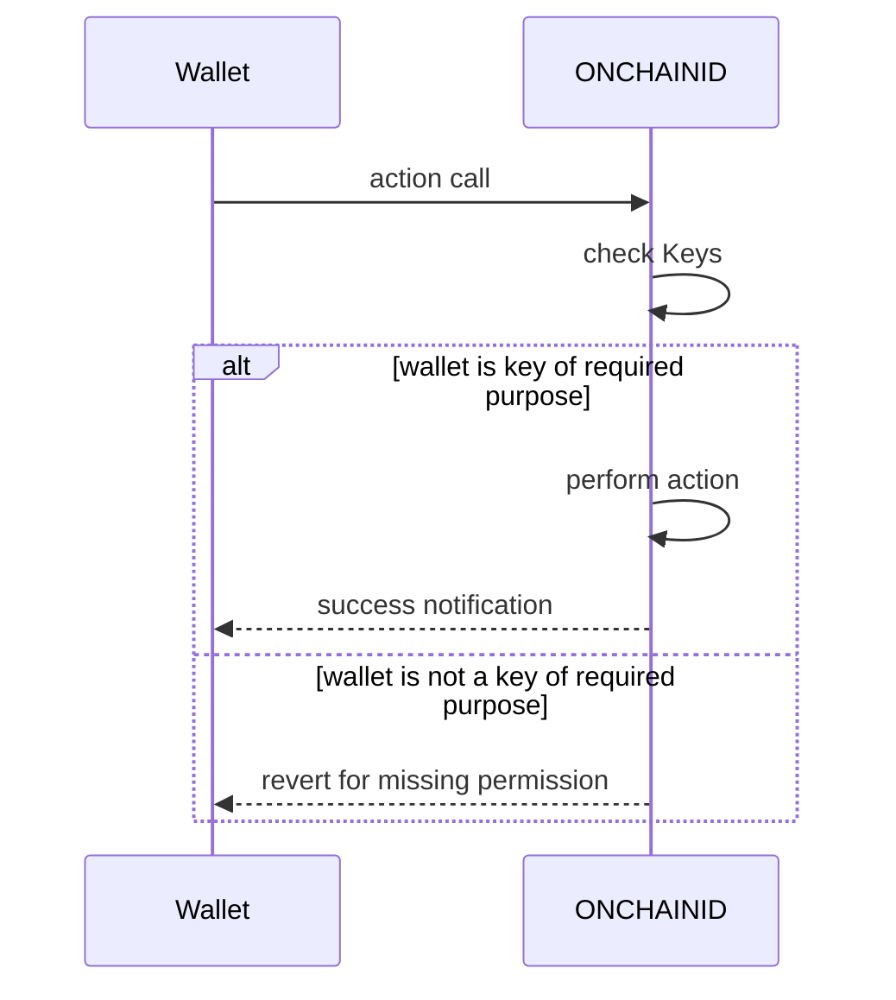
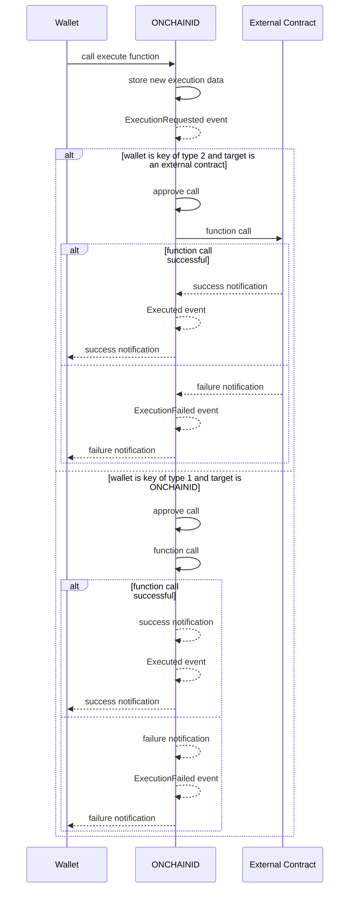
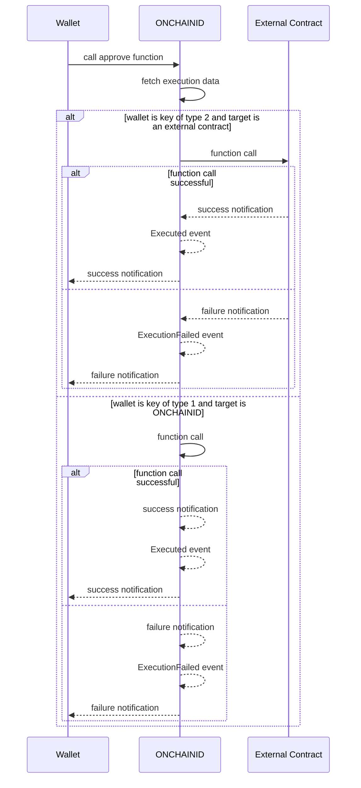
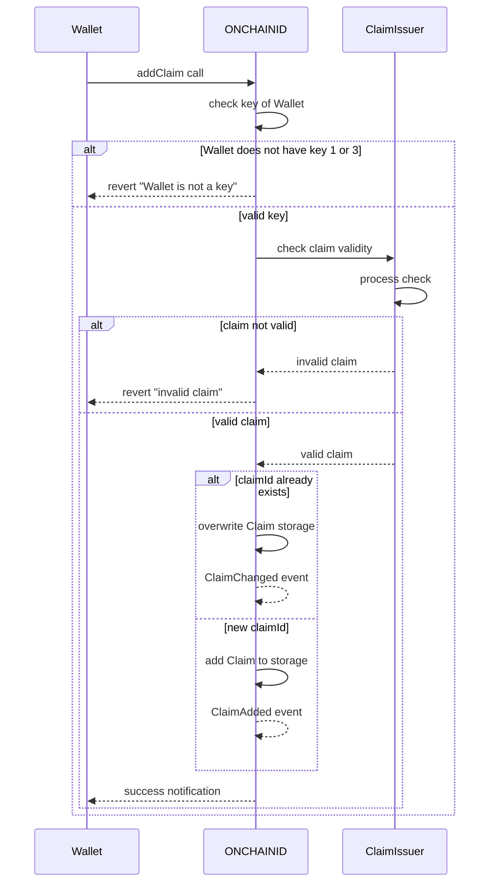
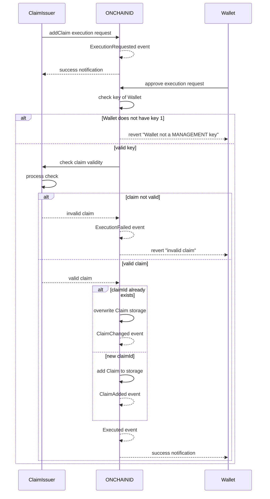
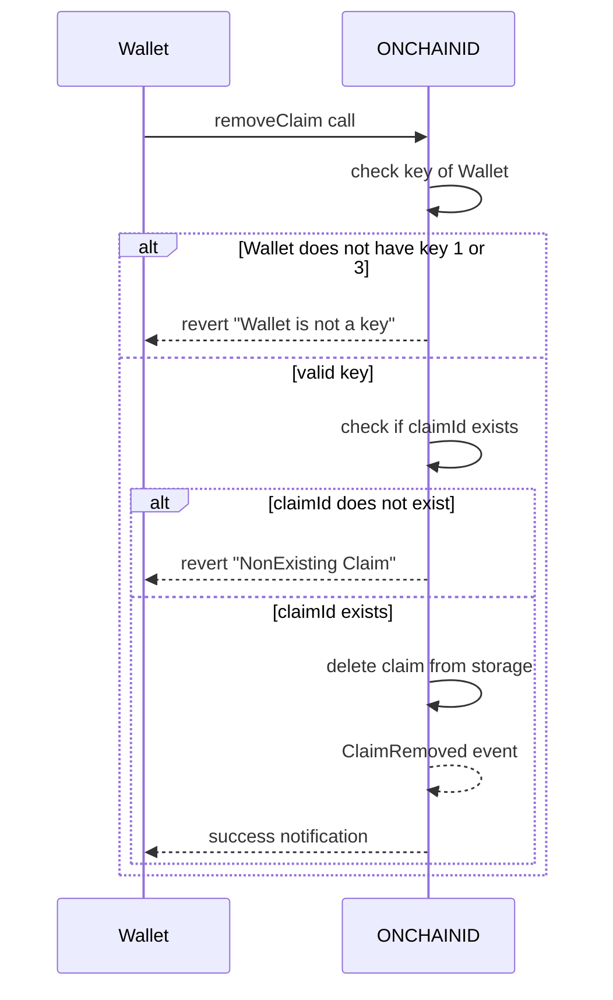

# ONCHAINID Smart Contracts

## Abstract

The ONCHAINID smart contract is an implementation of the ERC 734 and ERC 735 interfaces.

# ERC 734 - KEY manager

## Abstract

The ERC734 is an ethereum standard describing a smart contract acting as a key manager. This contract allows for the
management of keys and the execution of actions in a secure and controlled manner. The contract includes various
functionalities that allow for the management of keys, such as adding and removing keys, as well as the execution of
actions on the contract, such as approving and executing specific actions. The contract also includes a mechanism for
verifying the authorization of parties to perform specific actions on the contract. Additionally, the contract emits
events to track the status and outcome of actions performed on the contract. This standard interface serves as a
standardized way for key managers to interact with other smart contracts and ensure that only authorized parties can
perform specific actions.

## Key Management

ONCHAINID implements key management functions as defined in the ERC734 interface. The addKey function allows for the
addition of a key to the identity contract, with the purpose of the key being specified as an input. The key is
represented by a Keccak256 hash of an Ethereum address, this is to ensure that the key is unique and cannot be tampered
with.

The addKey function can be called by keys of purpose 1, which are known as MANAGEMENT keys. These keys are used to
manage the identity contract, and have the permission to add or remove keys from the identity contract. Additionally,
the identity contract itself can also add keys, in this case, the approval process will determine its approval.

ONCHAINID defines four key types:

1. MANAGEMENT keys, which can manage the identity.
2. ACTION keys, which perform actions in this identities name (signing, logins, transactions, etc.).
3. CLAIM signer keys, used to sign claims on other identities which need to be revokable.

This allows for different keys to have different permissions and be used for different purposes, ensuring that the
appropriate key is used for the appropriate action.

The `keyHasPurpose` function checks if a key has a specific purpose, it returns true if the key has MANAGEMENT purpose
or the specified purpose. This function allows for the checking of the permissions of a key, ensuring that the key has
the necessary permissions to perform a specific action. The `getKey` function returns the full key data, if present in
the identity, this allows for the retrieval of the key information for further use.

In summary, this smart contract allows for the management of keys, including the addition and removal of keys, and the
checking of key purposes. These functionalities allow for the secure and controlled execution of actions on the
contract, ensuring that only authorized parties can perform specific actions. It also allows for different keys to have
different permissions and be used for different purposes, ensuring that the appropriate key is used for the appropriate
action. Additionally, it provides a way to verify the authorization of parties to perform specific actions on the
contract, and allows for the retrieval of key information for further use.



Flow of action call on an ONCHAINID contract

## Approval and Execution process

The approve function is used to approve an execution or claim addition. This function is designed to work in conjunction
with the execute function and it serves as a mechanism for controlling the execution of actions on the smart contract.

The approve function takes two inputs: the ID of the execution and a Boolean value indicating whether or not the
execution is approved.

The function first checks if the execution is targeted at the identity contract itself, and if so, it requires that the
sender has a key with purpose 1 (management key) in order to approve the execution. If the execution is targeted at
another contract, the sender must have a key with purpose 2 (action key) in order to approve the execution.

If the execution is approved, the function sets the approved field of the execution to true and then calls the target
contract with the specified data and value. If the call is successful, the function sets the executed field of the
execution to true and emits an Executed event. If the call is not successful, the function emits an ExecutionFailed
event.

If the execution is not approved, the function sets the approved field of the execution to false. The function returns a
Boolean value indicating whether or not the approval was successful.

The execute function is used to pass an execution instruction to the keymanager. This function takes in a number of
inputs, including the ID of the execution, the target contract address, the value and data to be passed to the target
contract, and the gas required for the execution.

> :::caution
>
> The Execute function is public and can be called by any wallet to request an execution on the ONCHAINID. Therefore
> this function presents a risk as anyone could send requests for anything, including malicious requests! It is very
> important to keep that in mind when displaying the requested executions on a dApp. It is recommended to filter the
> execution requests, e.g. display only the requests coming from wallets that the ONCHAINID previously interacted with,
> or coming from trusted third parties (trusted claim issuers, financial institutions, etc), the ONCHAINID owner could
> also whitelist wallets from which they accept receiving execution requests.
>
> **Not filtering execution requests could
> lead to loss of funds in case the ONCHAINID owner accepts a malicious request.**
>
> :::

The approve function first checks if the execution has been previously approved (cannot approve twice, as the execution
is processed with approval) and if the approved field of the execution is set to true. If these conditions are met, the
function sends the transaction to the target contract with the specified data and value, using the gas specified in the
input. If the transaction is successful, the function emits an Executed event. If the transaction is not successful, the
function emits an ExecutionFailed event.

The approve and execute functions work together to provide a mechanism for controlling the execution of actions on the
smart contract. The approve function serves as a gatekeeper for the execute function, ensuring that only approved
actions are executed.



call of execute function with alternatives depending on the status of the caller



call of approve function on an existing execution request, from a wallet that has the required key for the approval
of the execution. Note that in case the caller has not the required key, the approve function will revert. In case
the execution was already approved and processed, the approve function will revert, and in case the execution ID
doesn't exist, the approve function will revert as well.

# ERC 735 - CLAIM Manager

## Abstract

ONCHAINID implements the ERC 735 interface, which is a standard for managing claims within a smart contract. It allows
for the
addition, removal,
and modification of claims on a particular topic, and provides several events to track these actions. The claims
have to be previously signed by an issuer, and are identified by a unique ID generated by the smart
contract.

## Claim Management

### Structure of a Claim

A claim is an information an issuer has about the identity holder. This contains the following:

- `topic`: A `uint256` number which represents the topic of the claim. (e.g. 1 KYC, 2 AML)
- `scheme`: The scheme with which this claim SHOULD be verified or how it should be processed. Its a `uint256` for
  different schemes. Refer to [claim constants](./../sdk/constants.md).
- `issuer`: The `ClaimIssuer` contract address. The `key` used to sign the claim MUST be a `key` of Type `1` or `3`
  on the `ClaimIssuer` contract, if it is not the case the claim cannot be added to the ONCHAINID (check of claim
  validity on the `addClaim` function. if the key is not present anymore,
  the claim SHOULD be treated as invalid.
- `signature`: Signature which is the proof that the claim issuer issued a claim of topic for this identity. it MUST
  be a signed message of the following structure: `keccak256(abi.encode(identityHolder_address, topic, data))`
- `data`: The hash of the claim data, sitting in another location, a bit-mask, call data, or actual data based on the
  claim scheme.
- `uri`: The location of the claim, this can be HTTP links, swarm hashes, IPFS hashes, and such.

Claims are defined with the following structure on the smart contracts:

```solidity
struct Claim {
    uint256 topic;
    uint256 scheme;
    address issuer;
    bytes signature;
    bytes data;
    string uri;
}
```

### Add or Update a Claim

Adding a new claim to an ONCHAINID can be done using the `addClaim()` function, which is part of the ERC-735 standard.
This function requires the `msg.sender` to have a claim signer key.
The function will verify the validity of the claim by calling the `isClaimValid()` function from the `ClaimIssuer`
contract. If the Claim is not valid, it will not be possible to add the Claim to the ONCHAINID.

Once the claim is verified, the function stores the data in the claim and pushes the claimId to the claimsByTopic array.
This array keeps track of all the claims associated with a particular topic.
Finally, the `addClaim()` function triggers the `ClaimAdded` event depending on the situation.

This function is an important part of the ERC-735 standard, as it allows users to securely add claims to their identity
contracts.

The Claim Update works the same way, the update can happen when you try to add a claim for an existing claimId.
Knowing that the claimId is defined as `keccak256(abi.encode(issuer, topic))` it becomes evident that if you try
to call `addClaim()` for a claim that has the same `issuer` and `topic` it will overwrite the existing claim with
the same `claimId` and that's how the claim update is possible.



Flow of claim addition/update when the claim signature is passed to the ONCHAINID owner via off chain communication.



Flow of claim addition/update using Execute/approve functions, with the claim details passed onchain by the claim
issuer.

### Remove a Claim

Removing a claim from an ONCHAINID contract requires the use of the `removeClaim()` function, which is part of the
ERC-735 standard. This function requires the `msg.sender` to have a claim signer key (type `1` or `3`)) and a claimId as
its parameter.

When the `removeClaim()` function is called, it first verifies that the `claimId` exists by iterating through
the `claimsByTopic` array. Once the `claimId` is found, it is removed from the array and the `ClaimRemoved` event is
triggered. This event notifies the identity contract of the claim's removal. Finally, the claim is deleted from
the `_claims` mapping. This ensures that the claim is no longer associated with the identity contract.



Flow for claim removal from an ONCHAINID


