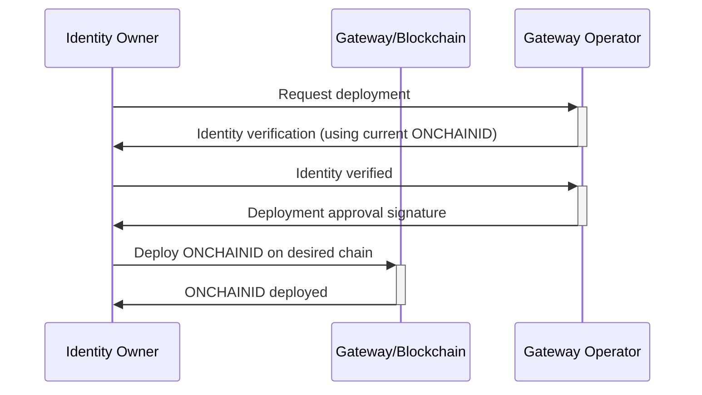

# Gateway

The Gateway contract is designed to interact with the Factory (the factory uses a Ownable mechanics to allow deployments
of ONCHAINIDs). For a local usage or a custom implementation, the Factory can be used alone, but some companies
managing many identities across multiples chains may want to use the Factory and the Gateway to have ONCHAINIDs
deployed with identical addresses.

> Note that this *could* be implemented using Oracles and decentralized networks.
However, we think fully decentralized and user-owned identities should be deployed as standalone contracts without a
Factory and/or Gateway.

## Why a Gateway?

The Factory allows to deploy ONCHAINIDs using the same addresses across multiple chains. However, we cannot allow
anyone to deploy an ONCHAINID using that factory (otherwise a user would be able to use salts that should be reserved
for other identities).

The Gateway contract is designed to allow users to deploy ONCHAINIDs using their wallet address as a salt, meaning they
can deploy their own ONCHAINID on any chain and have the same address. If a user loses access to their wallet, they
would never be able to deploy their ONCHAINID again with the same address on other chains. We therefore allow a user to
deploy their ONCHAINID using a custom salt (e.g. their lost wallet address) so that they can still have the same address
for their ONCHAINID. As a protection mechanism, we require the user to provide a message signed by a Gateway trusted
address.

Some implementation of the protocol also base identities on a master chain. Other chains have Gateways that require
signatures to deploy any ONCHAINIDs. 

## How to use the Gateway?



> :::danger
> 
> Allowing a user to deploy an ONCHAINID using a custom salt is a security risk. The Gateway Operator should always make
> sure to properly verify the identity of the user before signing the approval message. When using approval signed by
> third parties, they should validate the signer performs these verification.
>
> :::


Once a user obtains their approval signature, they can deploy their ONCHAINID on any chain that have a Gateway trusting
the signer.

```solidity
deployIdentityWithSalt(address identityOwner, string memory salt, uint256 signatureExpiry, bytes calldata signature);
```

```javascript
await gateway.deployIdentityWithSalt(
  managementKeyAddress,
  'customSalt',
  signatureExpiry,
  signature,
);
```

> To deploy an identity using the wallet as the salt, use the `deployIdentityForWallet(address identityOwner)` method.

> To deploy an identity using a custom salt and a specific list of management keys (other that the identity owner
> address), use the `function deployIdentityWithSaltAndManagementKeys(address identityOwner, string memory salt,
> bytes32[] calldata managementKeys, uint256 signatureExpiry, bytes calldata signature)` method.
> **Note that the `identityOwner` address won't be added as a management key, only the keys specified in the
> `managementKeys` array will.**

## Specifications

### Approval signature message content

The approval is a signature of the following message:

```solidity
import "@openzeppelin/contracts/utils/cryptography/ECDSA.sol";

using ECDSA for bytes32;

keccak256(
    abi.encode(
        "Authorize ONCHAINID deployment",
        managementKeyAddress,
        salt,
        signatureExpiry,
    )
).toEthSignedMessageHash();
```

> `toEthSignedMessageHash` is a function from OpenZeppelin's `ECDSA` library, it prefixes the message.

```javascript
const digest = ethers.utils.keccak256(
    ethers.utils.defaultAbiCoder.encode(
        ['string', 'address', 'string', 'uint256'],
        [
          'Authorize ONCHAINID deployment',
          managementKeyAddress,
          'saltToUse',
          BigNumber.from(new Date().getTime()).div(1000).add(365 * 24 * 60 * 60), // expiry solidity timestamp (in seconds)
        ],
    ),
);
const signature = await carolWallet.signMessage(
    ethers.utils.arrayify(
        digest,
    ),
);
```

> Setting the expiry to `0` will make the signature valid until explicitly revoked.

For signatures used by the `deployIdentityWithSaltAndManagementKeys` method, the content is extendend with the list of
management keys to use:

```solidity
import "@openzeppelin/contracts/utils/cryptography/ECDSA.sol";

using ECDSA for bytes32;

keccak256(
    abi.encode(
        "Authorize ONCHAINID deployment",
        identityOwner,
        salt,
        managementKeys,
        signatureExpiry,
    )
).toEthSignedMessageHash();
```

```javascript
const digest = ethers.utils.keccak256(
    ethers.utils.defaultAbiCoder.encode(
        ['string', 'address', 'string', 'bytes32[]', 'uint256'],
        [
          'Authorize ONCHAINID deployment',
          managementKeyAddress,
          'saltToUse',
          [
            ethers.utils.defaultAbiCoder.encode(['address'], [key1]),
            ethers.utils.defaultAbiCoder.encode(['address'], [key2]),
          ],
          BigNumber.from(new Date().getTime()).div(1000).add(365 * 24 * 60 * 60), // expiry solidity timestamp (in seconds)
        ],
    ),
);
const signature = await carolWallet.signMessage(
    ethers.utils.arrayify(
        digest,
    ),
);
```
