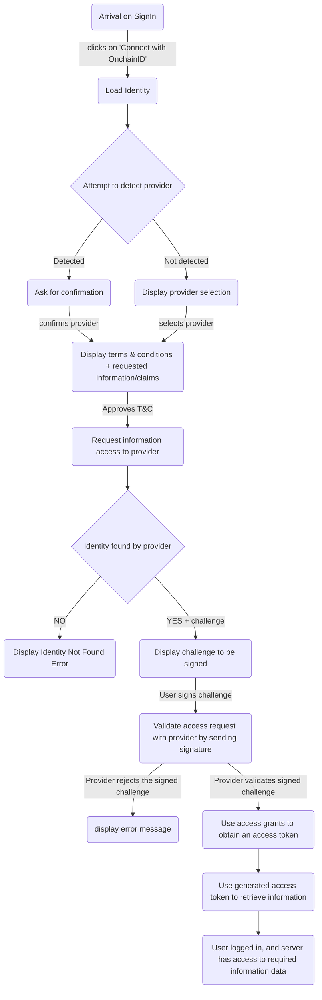

# Connect with OnchainID

An OnchainID allows to login to a website using your Identity as it is possible with Social Providers.

When an user attempt to login, the server generates a challenge to be signed using a wallet linked to the Identity.
The server can request access to some Information and Claims about the Identity.

The following process explains the authentication flow for **Connect with Identity**.
To summarize, a website requests access to certain set of information, and allows the connection once it has all the access it requires.
The website (or service provider) can request more access, but it requires each time a new signature from the Identity Owner.

An Identity Owner using its Identity can share, on the request of the service, a list of data related to the Identity. The Identity Owner signs this list, and the service has access to this list only. This may include:

- First and Last Name
- Email
- Phone number (if available)
- Address
- Any claim data stored by the Tokeny Identity Service.

Once the Identity is connected, the Identity Owner will be able to share additional data such as:

- Other claim data or information stored by other Information Providers or Claim issuers.

There are multiple ways to required access to information: 
* **Immediate grants**, which only allow access once to information,
* **Persistent grants**, which allow longer-term access until the grant is revoked by the Identity Owner.

Refer to the [Sharing data](grants.md) section for more information about access grants.

