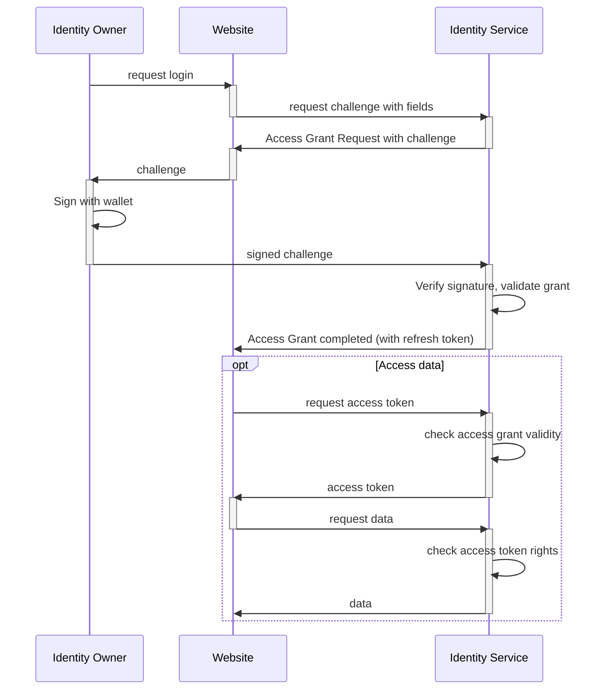
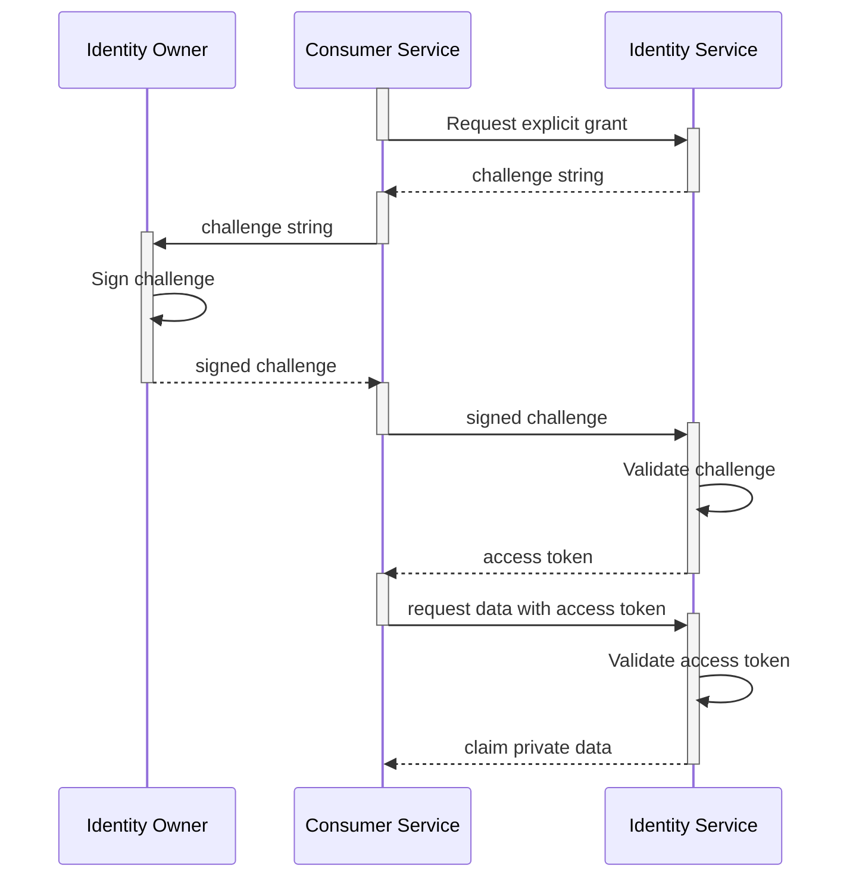
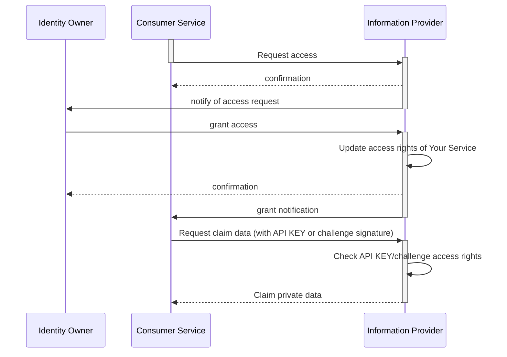

# Sharing Identity data

## Concept

InvestorID gives the Identity Owner the control of his/her Identity.
When an Identity Owner decides to share information about the Identity with a third-party service,
an explicit signature of an access challenge is requested.

This allows Information Consumers to request access to Identity Data such as:

- Basic Information data (first name, last name, email, phone, address).
- Claim data (access to a precise claim content) 

By signing an access challenge, the Identity Owner creates an Access Grant for a service, that can be revoked if needed.
*Note that a revocation will not delete the data eventually stored by the service, but will prevent it from access again
to the data that can be updated.*

The following sequence diagram illustrates the access grant flow:

## Types of Access grants

There are two types of access grants flow:

|                                   |                                                                                                                                                                                  |
| --------------------------------- | -------------------------------------------------------------------------------------------------------------------------------------------------------------------------------- |
| **Synchronous immediate grant**   | The user will sign a challenge that the service will use immediately to access the data. **The access grant can be used only once.** _The grant will remain stored as a proof._  |
| **Asynchronous persistent grant** | A service requests access to the data. The Identity Owner will be notified and will be able to later approve the request. **The access grant can be used until it is revoked.**  |

An Access Grant can be requested with a **`POST`** from the URI of the resource to be shared, with `/access-requests` appended.

_For instance, if a claim has to be shared, and its URI is `GET http://api.identity-service.example.com/claims/09724-IiuD73-989bjD8`, the access grant request url will be `POST http://api.identity-service.example.com/claims/09724-IiuD73-989bjD8/access-requests`._

The response Location will point toward the URI of the Access Grant request, that can be itself validated by appending `POST` `/validations`.

_In the above example, to validate the access grant request, call `POST http://api.identity-service.example.com/access-grants/8hy67-hu79k-gf76hk/validations`._

Information Providers should support at least one of the following authentication methods for Service Providers:

- API Keys.
- Challenge Signature flow.

### Synchronous Immediate grant

### Asynchronous Persistent Grant

The *confirmation* response from the Identity Service returns to the requester service the challenge to be signed.
This means that the service can request the Identity Owner signature without having to wait for the notification to be sent to the user.

## Revoking and monitoring Access Grants

Each **Information Provider** offers different level of access grants control. Some might accept only immediate grants.

Some will allow Identity Owners to see which access grants they emitted, both immediate and persistent, and how they are currently used.

When an Identity Owner revokes an Access Grants, the related service should no longer be able to access the data.
